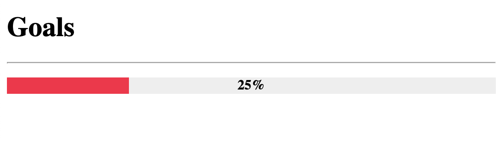

[:octicons-file-code-24:][_progressbar]{: .source-link }

# ProgressBar

## Overview

ProgressBar is an extension that adds support for progress/status bars.  It can take percentages or fractions, and it
can optionally generate classes for percentages at specific value levels.  It also works with Python Markdown's built
in `attr_list` extension.

The basic syntax for progress bars is: `[= <percentage or fraction> "optional single or double quoted title"]`.  The
opening `[` can be followed by one or more `=` characters. After the `=` char(s) the percentage is specified as either
a fraction or percentage and can optionally be followed by a title surrounded in either double quotes or single
quotes.

```text title="Progress Bars"
[=0% "0%"]
[=5% "5%"]
[=25% "25%"]
[=45% "45%"]
[=65% "65%"]
[=85% "85%"]
[=100% "100%"]
```

/// html | div.result
[=0% "0%"]
[=5% "5%"]
[=25% "25%"]
[=45% "45%"]
[=65% "65%"]
[=85% "85%"]
[=100% "100%"]
///

Though progress bars are rendered as block items, it accepts `attr_list`'s inline format.
`markdown.extensions.attr_list` must be enabled for the following to work.

```text title="Progress Bars with Attributes"
[=85% "85%"]{: .candystripe}
[=100% "100%"]{: .candystripe .candystripe-animate}

[=0%]{: .thin}
[=5%]{: .thin}
[=25%]{: .thin}
[=45%]{: .thin}
[=65%]{: .thin}
[=85%]{: .thin}
[=100%]{: .thin}
```

/// html | div.result
[=85% "85%"]{: .candystripe}
[=100% "100%"]{: .candystripe .candystripe-animate}

[=0%]{: .thin}
[=5%]{: .thin}
[=25%]{: .thin}
[=45%]{: .thin}
[=65%]{: .thin}
[=85%]{: .thin}
[=100%]{: .thin}
///

The ProgressBar extension can be included in Python Markdown by using the following:

```py3
import markdown
md = markdown.Markdown(extensions=['pymdownx.progressbar'])
```

## Styling with CSS

The general HTML structure of the progress bar is as follows:

```html
<div class="progress progress-100plus">
    <div class="progress-bar" style="width:100.00%">
        <p class="progress-label">100%</p>
    </div>
</div>
```

Classes                  | Description
------------------------ |------------
`progress`               | This is attached to the outer `div` container of the progress bar.
`progress-bar`           | This is attached to the inner `div` whose width is adjusted to give the visual appearance of a bar at the desired percentage.
`progress-label`         | This is attached to the `p` element that will contain the desired label.
`progress-<integer>plus` | This is an optional class that indicates the percentage of the progress bar by increments defined by `progress_increment`.

/// settings | CSS Setup

You are able to style your progress bars as fancy or plain as you want. Below is just a basic example. Depending
on existing styles in your page, it may or may not require tweaking.

//// tab | Preview

////

//// tab | HTML
```html
<h1>Goals</h1>
<hr />
<p>
<div class="progress progress-20plus">
<div class="progress-bar" style="width:25.00%">
<p class="progress-label">25%</p>
</div>
</div>
</p>
```
////

//// tab | CSS
///// collapse-code
```css
.progress-label {
  position: absolute;
  text-align: center;
  font-weight: 700;
  width: 100%;
  margin: 0;
  line-height: 1.2rem;
  white-space: nowrap;
  overflow: hidden;
}

.progress-bar {
  height: 1.2rem;
  float: left;
  background-color: #2979ff;
}

.progress {
  display: block;
  width: 100%;
  margin: 0.5rem 0;
  height: 1.2rem;
  background-color: #eeeeee;
  position: relative;
}

.progress.thin {
  margin-top: 0.9rem;
  height: 0.4rem;
}

.progress.thin .progress-label {
  margin-top: -0.4rem;
}

.progress.thin .progress-bar {
  height: 0.4rem;
}

.progress-100plus .progress-bar {
  background-color: #00e676;
}

.progress-80plus .progress-bar {
  background-color: #fbc02d;
}

.progress-60plus .progress-bar {
  background-color: #ff9100;
}

.progress-40plus .progress-bar {
  background-color: #ff5252;
}

.progress-20plus .progress-bar {
  background-color: #ff1744;
}

.progress-0plus .progress-bar {
  background-color: #f50057;
}
```
/////
////
///

## Options

Option               | Type    | Default      | Description
-------------------- | ------- | ------------ |------------
`level_class`        | bool    | `#!py3 True` | Enables or disables the level class feature.  The level class feature adds level classes in increments defined by `progress_increment`.
`add_classes`        | string  | `#!py3 ''`   | This option accepts a string of classes separated by spaces.
`progress_increment` | integer | `#!py3 20`   | Defines the increment at which the `level_class` classes are generated at.
