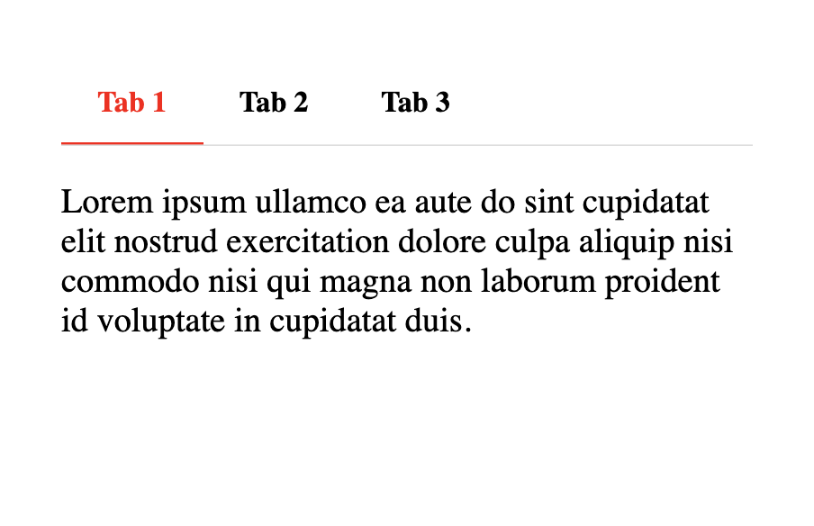
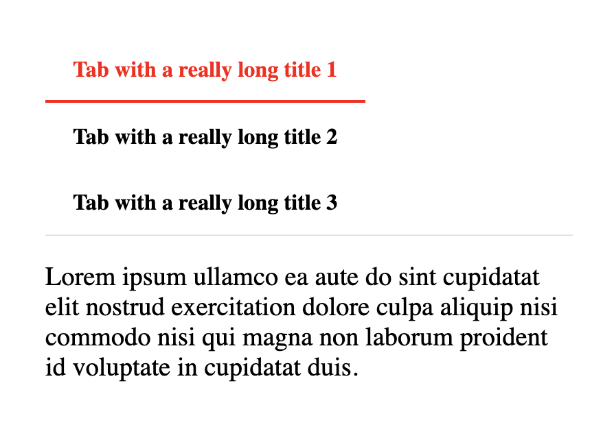

[:octicons-file-code-24:][_tabbed]{: .source-link }

# Tabbed

/// tip | 9.10 New Approach to Tabs
9.10 has added a new approach to creating tabs. Checkout the new [Tab extension here](./blocks/plugins/tab.md)!
///

## Overview

/// new | New 7.0
Tabbed has been newly added in 7.0.
///

Tabbed provides a syntax to easily add tabbed Markdown content. The Tabbed extension can be included in Python Markdown
by using the following:

```py3
import markdown
md = markdown.Markdown(extensions=['pymdownx.tabbed'])
```

## Syntax

Tabs start with `===` to signify a tab followed by a quoted title. Consecutive tabs are grouped into a tab set.

```text title="Tabs"
=== "Tab 1"
    Markdown **content**.

    Multiple paragraphs.

=== "Tab 2"
    More Markdown **content**.

    - list item a
    - list item b
```

/// html | div.result

=== "Tab 1"
    Markdown **content**.

    Multiple paragraphs.

=== "Tab 2"
    More Markdown **content**.

    - list item a
    - list item b
///

In the rare case that you want to follow two separate tab sets right after each other, you can explicitly mark the start
of a new tab set with `!`.

````text title="Tab Breaks"
=== "Tab 1"
    Markdown **content**.

    Multiple paragraphs.

=== "Tab 2"
    More Markdown **content**.

    - list item a
    - list item b

===! "Tab A"
    Different tab set.

=== "Tab B"
    ```
    More content.
    ```
````

/// html | div.result

=== "Tab 1"
    Markdown **content**.

    Multiple paragraphs.

=== "Tab 2"
    More Markdown **content**.

    - list item a
    - list item b

===! "Tab A"
    Different tab set.

=== "Tab B"
    ```
    More content.
    ```
///

## Tab Select

/// new | New 9.7
///

If you'd like to force a tab to be selected, simply use `===+`, otherwise, the first tab will be selected by default.

```text
=== "Not Me"
    Markdown **content**.

    Multiple paragraphs.

===+ "Select Me"
    More Markdown **content**.

    - list item a
    - list item b

=== "Not Me Either"
    Another Tab
```

/// note
If you are using JavaScript to track selected tabs across pages, or some other tab related feature that adjusts selected
tabs, it may interfere with the default selected tab. This is not an indication that there is a bug, but an indication
of incompatible features.
///

## Tab IDs

/// new | New 9.0
///

By default, tabs generate IDs for each tab using the following template `__tabbed_<tab_set_number>_<tab_number>`. If it
is desired to implement jumping to a specific tab with more intuitive IDs, it may be preferable to generate IDs from
slugs. To do so, two [options](#options) are provided: `slugify` and `separator`.

/// tip
Jumping to tabs via IDs may require additional JavaScript to select the targeted tabs.
///

If `slugify` is given a slug function (you can use any that [ship with Pymdownx Extensions](../extras/slugs.md)), the
Tabbed extension will generate IDs from the tab titles just like headers. `separator` allows for the specifying of the
word separator (`-` is the default).

If you'd like the slugs to be prefixed with the slug of the parent header, you can enable the `combine_header_slug`
option. If you had the following example, normally the header slug would be `header` and the content tab would have the
slug `tab`.

```
# header

=== "tab"
    content
```

With `combine_header_slug` enabled, the header slug would still be `header`, but now the content tab slug would be
`header-tab`.

/// new | New 10.1
`combine_header_slug` is new in 10.1
///

## Styling with CSS

In order to use tabbed blocks, some additional CSS is needed. You can check out the configuration below which will
show the CSS and the HTML it targets. Keep in mind that the CSS provided below is just the minimum needed to get you
started. You can tweak it and modify it to get it how you like it.

In general, tabbed controls are wrapped in a `#!html <div>` with the class `tabbed-set`. They contain an
`#!html <input>` with an ID of `__tabbed_<tab_set_number>_<tab_number>`. All the `#!html <input>` elements from a
specific tab set will use the name `__tabbed_<tab_set_number>`. Particularly, a user should be mindful of the ID to keep
from explicitly using a conflicting ID. Auto-generated slugs shouldn't conflict though.


/// settings | Tabbed Code Setup
This is a very basic setup. Tabs can be styled in different ways, but this shows how to get it functionally working.
Here we show what it visually looks like, what the generated HTML looks like, and what the CSS looks like.

=== "Preview"
    

=== "HTML"
    ```html
    <div class="tabbed-set" data-tabs="1:3"><input checked="checked" id="__tabbed_1_1" name="__tabbed_1" type="radio" /><label for="__tabbed_1_1">Tab with a really long title 1</label><div class="tabbed-content">
    <p>Lorem ipsum ullamco ea aute do sint cupidatat elit nostrud exercitation dolore culpa aliquip nisi commodo nisi qui
    magna non laborum proident id voluptate in cupidatat duis.</p>
    </div>
    <input id="__tabbed_1_2" name="__tabbed_1" type="radio" /><label for="__tabbed_1_2">Tab with a really long title 2</label><div class="tabbed-content">
    <p>Lorem ipsum ullamco ea aute do sint cupidatat elit nostrud exercitation dolore culpa aliquip nisi commodo nisi qui
    magna non laborum proident id voluptate in cupidatat duis.</p>
    </div>
    <input id="__tabbed_1_3" name="__tabbed_1" type="radio" /><label for="__tabbed_1_3">Tab with a really long title 3</label><div class="tabbed-content">
    <p>Lorem ipsum ullamco ea aute do sint cupidatat elit nostrud exercitation dolore culpa aliquip nisi commodo nisi qui
    magna non laborum proident id voluptate in cupidatat duis.</p>
    </div>
    </div>
    ```

=== "CSS"
    //// collapse-code
    ```css
    /* General environment setup */
    html {
      background-color: black;
      height: 100%;
    }
    body {
      font-size: 120%;
      width: 100%;
      padding: 1em 2em;
      margin: 0 auto;
      background-color: white;
      height: 100%;
    }

    /* Tab style starts here */
    .tabbed-set {
      position: relative;
      display: flex;
      flex-wrap: wrap;
      margin: 1em 0;
      border-radius: 0.1rem;
    }

    .tabbed-set > input {
      display: none;
    }

    .tabbed-set label {
      width: auto;
      padding: 0.9375em 1.25em 0.78125em;
      font-weight: 700;
      font-size: 0.84em;
      white-space: nowrap;
      border-bottom: 0.15rem solid transparent;
      border-top-left-radius: 0.1rem;
      border-top-right-radius: 0.1rem;
      cursor: pointer;
      transition: background-color 250ms, color 250ms;
    }

    .tabbed-set .tabbed-content {
      width: 100%;
      display: none;
      box-shadow: 0 -.05rem #ddd;
    }

    .tabbed-set input {
      position: absolute;
      opacity: 0;
    }

    .tabbed-set input:checked:nth-child(n+1) + label {
      color: red;
      border-color: red;
    }

    @media screen {
      .tabbed-set input:nth-child(n+1):checked + label + .tabbed-content {
        order: 99;
        display: block;
      }
    }

    @media print {
      .tabbed-content {
        display: contents;
      }
    }
    ```
    ////
///

## Linked Tabs

Some sites will link tabs across tab containers. The easiest way to explain this is by example. Click a tab below and
see how they seem linked:

=== "Python"

=== "JavaScript"

===! "Python"

=== "JavaScript"

People ask about how to get this functionality from time to time, and the answer is JavaScript. It is the only real way
to get such functionality. While this can be achieved with varying degrees of intelligence -- save preferences across
pages for example -- we've provided a very basic example of how to accomplish this below.

The function, when called, will setup click events for every tab. When clicked, it will look for tabs of the same name
on the page and ensure they also get selected. It works for the default style and the new [alternate style](#alternate-style).

```js
const tabSync = () => {
  const tabs = document.querySelectorAll(".tabbed-set > input")
  for (const tab of tabs) {
    tab.addEventListener("click", () => {
      const current = document.querySelector(`label[for=${tab.id}]`)
      const pos = current.getBoundingClientRect().top
      const labelContent = current.innerHTML
      const labels = document.querySelectorAll('.tabbed-set > label, .tabbed-alternate > .tabbed-labels > label')
      for (const label of labels) {
        if (label.innerHTML === labelContent) {
          document.querySelector(`input[id=${label.getAttribute('for')}]`).checked = true
        }
      }

      // Preserve scroll position
      const delta = (current.getBoundingClientRect().top) - pos
      window.scrollBy(0, delta)
    })
  }
}
```

/// tip | Special Considerations
If you are combining this feature with something like ["tab select"](#tab-select), you may have to not link tabs on
initial page load to ensure the default is not overridden. The example above does not initiate tab linking on
initial page load, only registration of the event. Some may attempt to implement tab linkage such that selected tabs
are remembered across pages, special consideration would be required in such situations and is beyond the scope of
this simple example.
///

## Alternate Style

/// new | New 9.0
///

/// warning | Experimental Feature
///

The original idea behind the Tabbed extension was to provide a tabbed interface in Markdown that could be driven purely
by CSS. If JavaScript was disabled or unavailable, tab functionality would remain.

@squidfunk (Martin Donath), the author and maintainer of the [MkDocs Material theme][mkdocs-material], who originally
collaborated on the first Tabbed style, approached us again with a newer style.

The aim was to solve one big problem, namely that on narrower screen sizes (like mobile), tabs are broken onto separate
lines, like here for example.



And this is indeed a real issue with the current style. The bonuses of the current style is that it needs absolutely no
JavaScript and is driven by CSS alone. It supports as many tabs as you can throw at it but the downside is that when all
the tabs do not fit on a single line, they'll wrap which is not aesthetically pleasing in all themes or interfaces.

So, a new style was proposed, and we once again worked to hammer out the details, and in the end, we think we have
something that is better in many ways. The new style works with only CSS and does not actually need any JavaScript to be
functional, but it is ideally enhanced with a little JavaScript. The reason why is that when too many tabs are on a
single line, you can overflow them with CSS and make the tab container scrollable. This can provide a much more
aesthetically pleasing interface, but there are two caveats though:

1.  When tabs overflow, if you want a visual indicator that there are more tabs, it requires a little JavaScript.
2.  The number of tabs is limited by how many tabs you define in the CSS.

As for the first point, this seems an acceptable restraint. When JavaScript is available, you will get a nice visual
indicator, but if JavaScript is ever not available, or disabled, tab functionality will still work, just without the
indicators.

As for the second point, this also seems acceptable as most pages will usually have some upper limit of tabs that are
ever used. Pages can become quite cluttered when using too many tabs, and it seems reasonable that most would limit them
to some practical number.

/// settings | Alternate Tabbed Code Setup
The example below styles the tabs, adds indicators that work as buttons to navigate to the next tab when the there
are overflowed tabs, and scrolls tabs into view smoothly.

=== "Preview"
    

=== "HTML"
    ```html
    <div class="tabbed-set tabbed-alternate" data-tabs="1:3"><input checked="checked" id="__tabbed_1_1" name="__tabbed_1" type="radio" /><input id="__tabbed_1_2" name="__tabbed_1" type="radio" /><input id="__tabbed_1_3" name="__tabbed_1" type="radio" /><div class="tabbed-labels"><label for="__tabbed_1_1">Tab with a really long title 1</label><label for="__tabbed_1_2">Tab with a really long title 2</label><label for="__tabbed_1_3">Tab with a really long title 3</label></div>
    <div class="tabbed-content">
    <div class="tabbed-block">
    <p>Lorem ipsum ullamco ea aute do sint cupidatat elit nostrud exercitation dolore culpa aliquip nisi commodo nisi qui
    magna non laborum proident id voluptate in cupidatat duis.</p>
    </div>
    <div class="tabbed-block">
    <p>Lorem ipsum ullamco ea aute do sint cupidatat elit nostrud exercitation dolore culpa aliquip nisi commodo nisi qui
    magna non laborum proident id voluptate in cupidatat duis.</p>
    </div>
    <div class="tabbed-block">
    <p>Lorem ipsum ullamco ea aute do sint cupidatat elit nostrud exercitation dolore culpa aliquip nisi commodo nisi qui
    magna non laborum proident id voluptate in cupidatat duis.</p>
    </div>
    </div>
    </div>
    ```

=== "CSS"
    //// collapse-code
    ```css
    /* General environment setup */
    html {
      background-color: black;
      height: 100%;
    }
    body {
      font-size: 120%;
      width: 20em;
      padding: 1em 2em;
      margin: 0 auto;
      background-color: white;
      height: 100%;
    }

    /* Tab style starts here */
    .tabbed-alternate {
      position: relative;
      display: flex;
      flex-wrap: wrap;
      flex-direction: column;
      margin: 1em 0;
      border-radius: 0.1rem;
    }

    .tabbed-alternate > input {
      display: none;
    }

    .tabbed-labels {
      display: flex;
      width: 100%;
      overflow: auto;
      box-shadow: 0 -0.1rem #ddd inset;
      scrollbar-width: none;
    }
    .tabbed-labels::-webkit-scrollbar {
      display: none;
    }
    .tabbed-labels > label {
      width: auto;
      padding: 0.9375em 1.25em 0.78125em;
      font-weight: 700;
      font-size: 0.84em;
      white-space: nowrap;
      border-bottom: 0.1rem solid transparent;
      scroll-snap-align: start;
      border-top-left-radius: 0.1rem;
      border-top-right-radius: 0.1rem;
      cursor: pointer;
      transition: background-color 250ms, color 250ms;
    }
    .tabbed-labels > label:hover {
      color: red;
    }

    .tabbed-labels.tabbed-scroll-left::before {
      display: inline-block;
      font-size: 0.9em;
      position: absolute;
      top: 0.75em;
      left: 0;
      padding-right: 0.64em;
      color: gray;
      background: linear-gradient(to right, rgb(255, 255, 255) 75%, rgba(255, 255, 255, 0));
      content: "\25C0";
      cursor: pointer;
    }

    .tabbed-labels.tabbed-scroll-right::after {
      display: inline-block;
      font-size: 0.9em;
      position: absolute;
      top: 0.75em;
      right: 0;
      padding-left: 0.64em;
      color: gray;
      background: linear-gradient(to right, rgba(255, 255, 255, 0), rgb(255, 255, 255) 25%);
      content: "\25B6";
      cursor: pointer;
    }

    .tabbed-alternate .tabbed-content {
      width: 100%;
    }
    .tabbed-alternate input:nth-child(1):checked ~ .tabbed-content > :nth-child(1),
    .tabbed-alternate input:nth-child(2):checked ~ .tabbed-content > :nth-child(2),
    .tabbed-alternate input:nth-child(3):checked ~ .tabbed-content > :nth-child(3) {
      display: block;
    }
    .tabbed-alternate .tabbed-block {
      display: none;
    }
    @media screen {
      .tabbed-alternate input:nth-child(1):checked ~ .tabbed-labels > :nth-child(1),
      .tabbed-alternate input:nth-child(2):checked ~ .tabbed-labels > :nth-child(2),
      .tabbed-alternate input:nth-child(3):checked ~ .tabbed-labels > :nth-child(3) {
        color: red;
        border-color: red;
      }
    }
    @media print {
      .tabbed-labels {
        display: contents;
      }
      .tabbed-labels > label:nth-child(1) {
        order: 1;
      }
      .tabbed-labels > label:nth-child(2) {
        order: 2;
      }
      .tabbed-labels > label:nth-child(3) {
        order: 3;
      }

      .tabbed-alternate .tabbed-content {
        display: contents;
      }
      .tabbed-alternate .tabbed-block {
        display: block;
      }
      .tabbed-alternate .tabbed-block:nth-child(1) {
        order: 1;
      }
      .tabbed-alternate .tabbed-block:nth-child(2) {
        order: 2;
      }
      .tabbed-alternate .tabbed-block:nth-child(3) {
        order: 3;
      }
    }
    ```
    ////

=== "JS"
    //// collapse-code
    ```js
    // Identify whether a tab bar can be scrolled left or right and apply indicator classes 
    const tabOverflow = () => {
      const checkScroll = e => {
        // Use a margin as we just don't always align exactly on the right.
        const margin = 3
        const target = e.target
        if (!e.target.matches('.tabbed-labels')) {
          return
        }

        const scrollWidth = target.scrollWidth - target.clientWidth
        target.classList.remove('tabbed-scroll-left', 'tabbed-scroll-right')
        if (e.type === "resize" || e.type === "scroll") {
          if (scrollWidth === 0) {
            return
          }
          if (!target.scrollLeft) {
            target.classList.add('tabbed-scroll-right')
          } else if (target.scrollLeft < scrollWidth - margin){
            target.classList.add('tabbed-scroll-left', 'tabbed-scroll-right')
          } else {
            target.classList.add('tabbed-scroll-left')
          }
        }
      }

      // Change the tab to either the previous or next input - depending on which indicator was clicked.
      // Make sure the current, selected input is scrolled into view.
      const tabChange = e => {
        const target = e.target
        const selected = target.closest('.tabbed-set').querySelector('input:checked')
        let updated = null

        if (target.classList.contains('tabbed-scroll-right') && e.offsetX >= e.target.offsetWidth - 15) {
          const sib = selected.nextSibling
          updated = selected
          if (sib && sib.tagName === 'INPUT') {
            updated = sib
          }
        } else if (target.classList.contains('tabbed-scroll-left') && e.offsetX <= 15) {
          const sib = selected.previousSibling
          updated = selected
          if (sib && sib.tagName === 'INPUT') {
            updated = sib
          }
        }
        if (updated) {
          updated.click()
        }
      }

      const onResize = new ResizeObserver(entries => {
        entries.forEach(entry => {
          checkScroll({target: entry.target, type: 'resize'})
        })
      })

      const labels = document.querySelectorAll('.tabbed-alternate > .tabbed-labels')
      labels.forEach(el => {
        checkScroll({target: el, type: 'resize'})
        onResize.observe(el)
        el.addEventListener('resize', checkScroll)
        el.addEventListener('scroll', checkScroll)
        el.addEventListener('click', tabChange)
      })
    }

    // Smooth scroll tab into view when changed
    const tabScroll = () => {
      const tabs = document.querySelectorAll(".tabbed-alternate > input")
      for (const tab of tabs) {
        tab.addEventListener("change", () => {
          const label = document.querySelector(`label[for=${tab.id}]`)
          label.scrollIntoView({block: "nearest", inline: "nearest", behavior: "smooth"})
        })
      }
    }

    // Should run after document loaded, but for illustration purposes:
    tabOverflow()
    tabScroll()
    ```
    ////
///

## Options

Option                | Type     | Default       | Description
--------------------- | -------- | ------------- | -----------
`alternate_style`     | bool     | `#!py3 False` | Use the experimental, alternative style.
`slugify`             | function | `#!py3 None`  | A function to generate slugs from tab titles.
`separator`           | string   | `#!py3 '-'`   | Default word separator when generating slugs.
`combine_header_slug` | bool     | Combine the parent header slug with the tab content slug.
