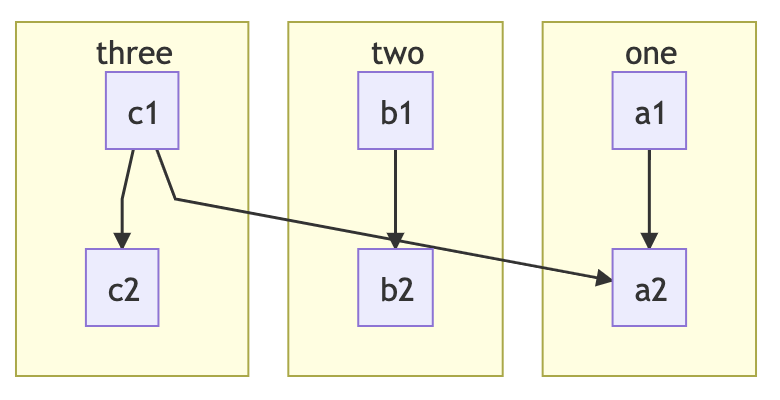
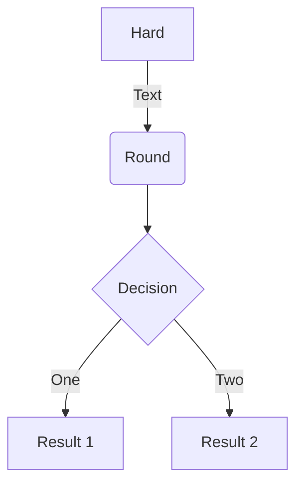

# Advanced Mermaid Notes

## Overview

/// warning | Support
This is provided to help users get Mermaid running, but we do not officially offer technical support for Mermaid.
Any issues encounter will require the user to debug it themselves.

There may or may not be issues using an older or newer version of Mermaid than what we have documented here. We may
not be always be up to date with the latest and greatest Mermaid version.

We would be happy to accept pull requests that offer to improve things here or to correct misinformation.
///

In [SuperFences](../extensions/superfences.md) we cover [custom fences](../extensions/superfences.md#custom-fences)
and provide an example for using [Mermaid diagrams](../extensions/superfences.md#uml-diagram-example). What we showed in
the example is the bare minimum required to get Mermaid working. While our example was mainly meant to instruct users on
how to use custom fences, it was not our intent to give an in depth explanation on how to get Mermaid setup and working
in the best way possible. To be honest, Mermaid is a little buggy and required some workarounds to alleviate some if its
quirks.

In general, we leave setting up custom fences for the user to explore, but we do get asked occasionally how to get
Mermaid working, and what we are doing, so we thought we'd share some some additional information in case there is a
strong desire from any of our users to implement a robust Mermaid solution.

If you'd like to see exactly what we do, you can checkout our source code, but in this example, we will show the basics.

## Practical Diagrams

There are a few diagrams that we feel do not work well for us, and we thought it useful to share why. The main reason is
that a few of the diagrams are a bit impractical to use due to sizing and scaling issues. While there may be a way to
massage them to work, we have not currently invested any time in workarounds for these diagrams.

Some of the less practical examples may work better if they were pre-rendered and included as an image instead. This
seems to be what Mermaid does in their own [documents][mermaid].

/// success | Practical
//// tab | Flowcharts

```diagram
graph TD
    A[Hard] -->|Text| B(Round)
    B --> C{Decision}
    C -->|One| D[Result 1]
    C -->|Two| E[Result 2]
```
////

//// tab | Sequence Diagrams
```diagram
sequenceDiagram
    participant Alice
    participant Bob
    Alice->>John: Hello John, how are you?
    loop Healthcheck
        John->>John: Fight against hypochondria
    end
    Note right of John: Rational thoughts <br/>prevail!
    John-->>Alice: Great!
    John->>Bob: How about you?
    Bob-->>John: Jolly good!
```
////

//// tab | Class Diagrams
```diagram
classDiagram
    Class01 <|-- AveryLongClass : Cool
    Class03 *-- Class04
    Class05 o-- Class06
    Class07 .. Class08
    Class09 --> C2 : Where am i?
    Class09 --* C3
    Class09 --|> Class07
    Class07 : equals()
    Class07 : Object[] elementData
    Class01 : size()
    Class01 : int chimp
    Class01 : int gorilla
    Class08 <--> C2: Cool label
```
////

//// tab | Entity Relationships
```diagram
erDiagram
    CUSTOMER ||--o{ ORDER : places
    ORDER ||--|{ LINE-ITEM : contains
    CUSTOMER }|..|{ DELIVERY-ADDRESS : uses
```
////

//// tab | State Diagrams
```diagram
stateDiagram
    [*] --> First
    First --> Second
    First --> Third

    state First {
        [*] --> fir
        fir --> [*]
    }
    state Second {
        [*] --> sec
        sec --> [*]
    }
    state Third {
        [*] --> thi
        thi --> [*]
    }
```
////

//// tab | Git Graph

```diagram
gitGraph
    commit
    branch hotfix
    checkout hotfix
    commit
    branch develop
    checkout develop
    commit id:"ash" tag:"abc"
    branch featureB
    checkout featureB
    commit type:HIGHLIGHT
    checkout main
    checkout hotfix
    commit type:NORMAL
    checkout develop
    commit type:REVERSE
    checkout featureB
    commit
    checkout main
    merge hotfix
    checkout featureB
    commit
    checkout develop
    branch featureA
    commit
    checkout develop
    merge hotfix
    checkout featureA
    commit
    checkout featureB
    commit
    checkout develop
    merge featureA
    branch release
    checkout release
    commit
    checkout main
    commit
    checkout release
    merge main
    checkout develop
    merge release
```
////

//// tab | Journey

```diagram
journey
    title My working day
    section Go to work
      Make tea: 5: Me
      Go upstairs: 3: Me
      Do work: 1: Me, Cat
    section Go home
      Go downstairs: 5: Me
      Sit down: 5: Me
```
////
///

/// failure | Impractical
//// tab | Gantt

Gantt charts usually are too big to render properly in a page. If the element is big enough to hold it, and the
chart is large, they render too small to see. If the element is not wide enough, the chart can sometimes render
squished and hard to read.

```diagram
gantt
    dateFormat  YYYY-MM-DD
    title Adding GANTT diagram to mermaid
    excludes weekdays 2014-01-10

    section A section
    Completed task            :done,    des1, 2014-01-06,2014-01-08
    Active task               :active,  des2, 2014-01-09, 3d
    Future task               :         des3, after des2, 5d
    Future task2               :         des4, after des3, 5d
```

////

//// tab | Pie

Pie at times can seem to work great, but other times it can be hard to read or missing labels all together.
Like the others in this list, it relates to sizing and scaling. For instance, if you were to view this on a
mobile device, you'd likely see the key for the pie chart missing.

```diagram
pie
    title Key elements in Product X
    "Calcium" : 42.96
    "Potassium" : 50.05
    "Magnesium" : 10.01
    "Iron" :  5
```

////
///

## Configuration

We do some configuration via the initialization API command to tweak the diagrams a little. This includes theming and
disabling of problematic features.

We include the Mermaid library normally, but use a custom loader as we wrap our diagrams in a non-standard way. In
addition, our custom loader allows us to workaround some problematic issues that arise when using Mermaid's default
loader.

For illustrative purposes, we've provided a basic, bare minimum configuration below that we use.

```js
window.mermaidConfig = {
  startOnLoad: false,
  theme: "default",
  flowchart: {
    htmlLabels: false,
    useMaxWidth: false
  },
  er: {
    useMaxWidth: false
  },
  sequence: {
    useMaxWidth: false,
    noteFontWeight: "14px",
    actorFontSize: "14px",
    messageFontSize: "16px"
  },
  journey: {
    useMaxWidth: false
  },
  gitGraph: {
    useMaxWidth: false
  }
}
```

/// note  | Configuration Notes
1.  We disable `htmlLabels` in flowcharts as we've had issues with it in the past. It may or may not be okay to
    enable. Your mileage may vary.

2.  If the option is available in a diagram, we disable `useMaxWidth` as we prefer that our diagrams do not scale
    within their parent element, we rather them overflow with a scrollbar. You can leave these enabled if you like.
    Since we render our diagrams under a custom element with a shadow DOM, to get scrollbars, we simply enable
    `#!css overflow: auto` on the custom `diagram-div` element (under the host DOM, not the shadow DOM).

3.  We disable `startOnLoad` as we provide our own loader (for reasons we will get into later).

4.  We do a quite a bit of custom theme overrides. Most of this is done through the Mermaid configuration options:
    `theme`, `themeVariables`, and `themeCSS`. Most users would simply use one of the default themes via the `theme`
    option, so that is what we've shown above.
///

## Custom Loader

While using Mermaid, we've found a couple of issues which we were able to solve by using our own custom loader. The
loader contains all the logic needed to find the Mermaid diagrams, convert them, wrap them in a shadow DOM, and insert
them into the current document.

In order to use the loader, it should be attached to a `DOMContentLoaded` event to execute only after the document is
loaded. We bind our logic to this event in our loader function that checks if the Mermaid library is loaded, and only if
it is, we execute the payload.

The issues we are working around withing Mermaid are found below:

/// bug | Issues
1.  Diagrams that are found in tabbed interfaces or details, where the element may be hidden on page load, don't
    always render at a visible size if using Mermaid's default loader.

2.  Mermaid uses IDs in their SVG diagrams, and these can sometimes cause conflicts if you happen to have IDs on your
    page that match one that they use.

3.  Mermaid does not always use unique IDs. This can cause some elements of a diagram to disappear if one diagram
    happens to have the same ID and it is hidden in a details element or a tabbed interface.
///

We solve these issues doing a couple things in our own custom loader.

/// success | Solutions
1.  Using the `#!html <body>` element as a parent, we attach a surrogate element to it and render the diagram there.
    Once rendered, we then insert the diagram back to where the original custom fence was. This ensures it renders
    under a visible parent, and renders at a normal size.

2.  We wrap each diagram in a shadow DOM element. This prevents ID leakage from one diagram to another or to the
    host.
///

Apart from the issues we were trying to solve, we also use a custom loader for personal aesthetics as we like to render
our diagrams in `#!html <pre><code>` tags. This allows us to render the diagrams as normal code blocks in the rare case
that we cannot load the Mermaid library from the specified CDN.

## Putting it All Together

So, putting it all together, we have the HTML generated by SuperFences. In the HTML, we include the Mermaid library
and provide the configuration. We also have the custom loader that is runs when the document is loaded.

/// tab | Preview

///

/// tab | HTML
```html
<!-- Pre/code generated by SuperFences -->
<pre class="mermaid"><code>graph TB
    c1--&gt;a2
    subgraph one
    a1--&gt;a2
    end
    subgraph two
    b1--&gt;b2
    end
    subgraph three
    c1--&gt;c2
    end</code></pre>

<!-- Include Mermaid script and user config -->
<script src="https://unpkg.com/mermaid@9.4.0/dist/mermaid.min.js"></script>
<script>
window.mermaidConfig = {
  startOnLoad: false,
  theme: "default",
  flowchart: {
    htmlLabels: false
  },
  er: {
    useMaxWidth: false
  },
  sequence: {
    useMaxWidth: false,
    noteFontWeight: "14px",
    actorFontSize: "14px",
    messageFontSize: "16px"
  }
}
</script>
```
///

/// tab | JS
```{.js .md-max-height}
const uml = className => {

  // Custom element to encapsulate Mermaid content.
  class MermaidDiv extends HTMLElement {

    /**
    * Creates a special Mermaid div shadow DOM.
    * Works around issues of shared IDs.
    * @return {void}
    */
    constructor() {
      super()

      // Create the Shadow DOM and attach style
      const shadow = this.attachShadow({mode: "open"})
      const style = document.createElement("style")
      style.textContent = `
      :host {
        display: block;
        line-height: initial;
        font-size: 16px;
      }
      div.diagram {
        margin: 0;
        overflow: visible;
      }`
      shadow.appendChild(style)
    }
  }

  if (typeof customElements.get("diagram-div") === "undefined") {
    customElements.define("diagram-div", MermaidDiv)
  }

  const getFromCode = parent => {
    // Handles <pre><code> text extraction.
    let text = ""
    for (let j = 0; j < parent.childNodes.length; j++) {
      const subEl = parent.childNodes[j]
      if (subEl.tagName.toLowerCase() === "code") {
        for (let k = 0; k < subEl.childNodes.length; k++) {
          const child = subEl.childNodes[k]
          const whitespace = /^\s*$/
          if (child.nodeName === "#text" && !(whitespace.test(child.nodeValue))) {
            text = child.nodeValue
            break
          }
        }
      }
    }
    return text
  }

  // Provide a default config in case one is not specified
  const defaultConfig = {
    startOnLoad: false,
    theme: "default",
    flowchart: {
      htmlLabels: false
    },
    er: {
      useMaxWidth: false
    },
    sequence: {
      useMaxWidth: false,
      noteFontWeight: "14px",
      actorFontSize: "14px",
      messageFontSize: "16px"
    }
  }

  // Load up the config
  mermaid.mermaidAPI.globalReset()
  const config = (typeof mermaidConfig === "undefined") ? defaultConfig : mermaidConfig
  mermaid.initialize(config)

  // Find all of our Mermaid sources and render them.
  const blocks = document.querySelectorAll(`pre.${className}, diagram-div`)
  const surrogate = document.querySelector("html")
  for (let i = 0; i < blocks.length; i++) {
    const block = blocks[i]
    const parentEl = (block.tagName.toLowerCase() === "diagram-div") ?
      block.shadowRoot.querySelector(`pre.${className}`) :
      block

    // Create a temporary element with the typeset and size we desire.
    // Insert it at the end of our parent to render the SVG.
    const temp = document.createElement("div")
    temp.style.visibility = "hidden"
    temp.style.display = "display"
    temp.style.padding = "0"
    temp.style.margin = "0"
    temp.style.lineHeight = "initial"
    temp.style.fontSize = "16px"
    surrogate.appendChild(temp)

    try {
      mermaid.mermaidAPI.render(
        `_diagram_${i}`,
        getFromCode(parentEl),
        content => {
          const el = document.createElement("div")
          el.className = className
          el.innerHTML = content

          // Insert the render where we want it and remove the original text source.
          // Mermaid will clean up the temporary element.
          const shadow = document.createElement("diagram-div")
          shadow.shadowRoot.appendChild(el)
          block.parentNode.insertBefore(shadow, block)
          parentEl.style.display = "none"
          shadow.shadowRoot.appendChild(parentEl)
          if (parentEl !== block) {
            block.parentNode.removeChild(block)
          }
        },
        temp
      )
    } catch (err) {} // eslint-disable-line no-empty

    if (surrogate.contains(temp)) {
      surrogate.removeChild(temp)
    }
  }
}

// This should be run on document load
document.addEventListener("DOMContentLoaded", () => {uml("mermaid")})
```
///

/// tip | Live Example
For a live, working example, check out the CodePen [here](https://codepen.io/facelessuser/pen/oNeNydQ).
///

## Using in MkDocs

If you are using MkDocs, you would probably include your config, mermaid library, and then your loader:

```yaml
markdown_extensions:
  - pymdownx.superfences:
      preserve_tabs: true
      custom_fences:
        # Mermaid diagrams
        - name: mermaid
          class: mermaid
          format: !!python/name:pymdownx.superfences.fence_code_format

extra_javascript:
  - optionalConfig.js
  - https://unpkg.com/mermaid@9.4.0/dist/mermaid.min.js
  - extra-loader.js
```

Then in your documents, do something like this:

````

````

To get something like this directly embedded in your documents:

```diagram
graph TD
    A[Hard] -->|Text| B(Round)
    B --> C{Decision}
    C -->|One| D[Result 1]
    C -->|Two| E[Result 2]
```
