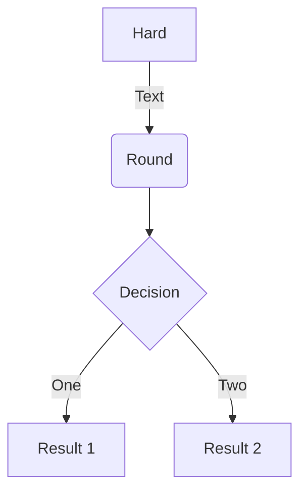

# Advanced Mermaid Notes

## Overview

!!! warning "Support"

    This is provided to help users get Mermaid running, but we do not officially offer technical support for Mermaid.
    Any issues encounter will require the user to debug it themselves.

    Thee may or may not be issues using an older or newer version of Mermaid than what we have documented here. We may
    not be always be up to date with the latest and greatest Mermaid version.

    We would be happy to accept pull requests that offer to improve things here or to correct misinformation.

In [SuperFences](../extensions/superfences.md) we cover [custom fences](../extensions/superfences.md#custom-fences)
and provide an example for using [Mermaid diagrams](../extensions/superfences.md#uml-diagram-example). What we showed in
the example is the bare minimum required to get Mermaid working. While our example was mainly meant to instruct users on
how to use custom fences, it was not our intent to give an in depth explanation on how to get Mermaid setup and working
in the best way possible. It especially does not go into quirks of Mermaid and how to get around common issues.

In general, we leave setting up custom fences for the user to explore, but since we've gone down this path already, and
find Mermaid so useful, we thought we'd share some some additional information in case there is a strong desire from any
of our users to implement a robust Mermaid solution.

## Setup

Our setup is found below. We use a custom loader and configuration to get what we feel is the best implementation for
our own personal use. We will explain some of our reasoning later, but below are reference links to the relevant code.

!!! settings "Setup"
    - [Events][onready-event].
    - [UML Loader][mermaid-loader].
    - [Mermaid configuration settings][mermaid-config].
    - [MkDocs configuration][mkdocs-config].

## Practical Diagrams

There are a few diagrams that we feel do not work well for us, and we thought it useful to share why. The main reason is
that a few of the diagrams are a bit impractical to use due to sizing and scaling issues. While there may be a way to
massage them to work, we have not currently invested any time in workarounds for these diagrams.

Some of the less practical examples may work better if they were pre-rendered and included as an image instead. This
seems to be what Mermaid does in their own [documents][mermaid].

!!! success "Practical"

    === "Flowcharts"
        ```mermaid
        graph TD
            A[Hard] -->|Text| B(Round)
            B --> C{Decision}
            C -->|One| D[Result 1]
            C -->|Two| E[Result 2]
        ```

    === "Sequence Diagrams"
        ```mermaid
        sequenceDiagram
            participant Alice
            participant Bob
            Alice->>John: Hello John, how are you?
            loop Healthcheck
                John->>John: Fight against hypochondria
            end
            Note right of John: Rational thoughts <br/>prevail!
            John-->>Alice: Great!
            John->>Bob: How about you?
            Bob-->>John: Jolly good!
        ```

    === "Class Diagrams"
        ```mermaid
        classDiagram
            Class01 <|-- AveryLongClass : Cool
            Class03 *-- Class04
            Class05 o-- Class06
            Class07 .. Class08
            Class09 --> C2 : Where am i?
            Class09 --* C3
            Class09 --|> Class07
            Class07 : equals()
            Class07 : Object[] elementData
            Class01 : size()
            Class01 : int chimp
            Class01 : int gorilla
            Class08 <--> C2: Cool label
        ```

    === "Entity Relationships"
        ```mermaid
        erDiagram
            CUSTOMER ||--o{ ORDER : places
            ORDER ||--|{ LINE-ITEM : contains
            CUSTOMER }|..|{ DELIVERY-ADDRESS : uses
        ```

    === "State Diagrams"
        ```mermaid
        stateDiagram
            [*] --> First
            First --> Second
            First --> Third

            state First {
                [*] --> fir
                fir --> [*]
            }
            state Second {
                [*] --> sec
                sec --> [*]
            }
            state Third {
                [*] --> thi
                thi --> [*]
            }
        ```

!!! fail "Impractical"

    === "Git"
        Git diagrams are experimental and often don't render to a reasonable size. They overflow, but won't trigger
        scrollbars. They are the only diagram that often renders too large for the element they are assigned to.

        ```mermaid
        gitGraph:
        options
        {
            "nodeSpacing": 150,
            "nodeRadius": 10
        }
        end
        commit
        branch newbranch
        checkout newbranch
        commit
        commit
        checkout master
        commit
        commit
        merge newbranch
        ```

    === "Gantt"

        Gantt charts usually are too big to render properly in a page. If the element is big enough to hold it, and the
        chart is large, they render too small to see. If the element is not wide enough, the chart can sometimes render
        squished and hard to read.

        ```mermaid
        gantt
            dateFormat  YYYY-MM-DD
            title Adding GANTT diagram to mermaid
            excludes weekdays 2014-01-10

            section A section
            Completed task            :done,    des1, 2014-01-06,2014-01-08
            Active task               :active,  des2, 2014-01-09, 3d
            Future task               :         des3, after des2, 5d
            Future task2               :         des4, after des3, 5d
        ```

    === "Journey"

        Journey diagrams suffer from the same issues as Gantt charts. They just do not scale well and are often hard to
        read.

        ```mermaid
        journey
            title My working day
            section Go to work
              Make tea: 5: Me
              Go upstairs: 3: Me
              Do work: 1: Me, Cat
            section Go home
              Go downstairs: 5: Me
              Sit down: 5: Me
        ```

    === "Pie"

        Pie at times can seem to work great, but other times it can be hard to read or missing labels all together.
        Like the others in this list, it relates to sizing and scaling. For instance, if you were to view this on a
        mobile device, you'd likely see the key for the pie chart missing.

        ```mermaid
        pie
            title Key elements in Product X
            "Calcium" : 42.96
            "Potassium" : 50.05
            "Magnesium" : 10.01
            "Iron" :  5
        ```

## Configuration

We do some configuration via the initialization API command to tweak the diagrams a little. This includes theming and
disabling of problematic features.

We only include the Mermaid library and the configuration options in pages that are actively rendering Mermaid diagrams.
This is to cut down on loading libraries in pages that aren't utilizing them. We do this by using
[Snippets](../extensions/snippets.md). We simply attach the necessary [snippet][mermaid-config] at the bottom of the
page. Our custom loader will only execute if the Mermaid library is loaded, so simply including the library will
trigger it.

!!! note "Configuration Notes"

    1. We disable `htmlLabels` in flowcharts as we've had issues with it in the past. It may or may not be okay to
       enable. Your mileage may vary.

    2. If the option is available in a diagram, we disable `useMaxWidth` as we prefer that our diagrams do not scale
       within their parent element, we rather them overflow with a scrollbar. You can leave these enabled if you like.
       Since we render our diagrams under a custom element with a shadow DOM, to get scrollbars, we simply enable
       `#!css overflow: auto` on the custom `mermaid-div` element (under the host DOM, not the shadow DOM). You can
       check out our stylesheet that does this [here][mermaid-style].

    3. We disable `startOnLoad` as we provide our own loader (for reasons we will get into later).

    4. We do a quite a bit of custom theme overrides. Most of this is done through the Mermaid configuration options:
       `theme`, `themeVariables`, and `themeCSS`. Most users would simply use one of the default themes via the `theme`
       option.

## Custom Loader

While using Mermaid, we've found a couple of issues which we were able to solve by using our own
[custom loader][mermaid-loader]. The loader contains all the logic needed to find the Mermaid diagrams, convert them,
wrap them in a shadow DOM, and insert them into the current document.

In order to use the loader, it should be attached to a `DOMContentLoaded` event to execute only after the document is
loaded. We create our own [`onReady`][onready-event] function that checks if the Mermaid library is loaded, and only if
it is, we execute our loader.

We also create an `observer` event that watches for when the attribute that controls the color scheme on our site
changes. When a color change occurs, we run our loader again and regenerate our diagrams. This is possible because we
hide away the original content in our shadow DOM along with the generated diagram.

!!! bug "Issues"

    1. Diagrams that are found in tabbed interfaces or details, where the element may be hidden on page load, don't
       always render at a visible size if using Mermaid's default loader.

    2. Mermaid uses IDs in their SVG diagrams, and these can sometimes cause conflicts if you happen to have IDs on your
       page that match one that they use.

    3. Mermaid does not always use unique IDs. This can cause some elements of a diagram to disappear if one diagram
       happens to have the same ID and it is hidden in a details element or a tabbed interface.

    4. We'd like to be able to have different configs for different color schemes (light mode, dark mode, etc.) and we'd
       like to be able to dynamically reload all the diagrams on theme change.

We solve these issues doing a couple things in our own custom loader.

!!! success "Solutions"

    1. Using the `#!html <body>` element as a parent, we attach a surrogate element to it and render the diagram there.
       Once rendered, we then insert the diagram back to where the original custom fence was. This ensures it renders
       under a visible parent, and renders at a normal size.

    2. We wrap each diagram in a shadow DOM element. This prevents ID leakage from one diagram to another or to the
       host.

    3. We accept our own config structure that allows us to specify different configs based on the scheme being used.
       We currently adopt what MkDocs Material uses and look for the `data-md-color-scheme` on the `body` tag. Depending
       on the scheme that is set there, we pick the config under that name. If none are found we try the `default`
       config, and if that is not found, we provide a sane default. We use a `MutationObserver` to watch for changes
       to that attribute and render the diagrams again with a new config.

Apart from the issues we were trying to solve, we also use a custom loader for personal aesthetics as we like to render
our diagrams in `#!html <pre><code>` tags. This allows us to render the diagrams as normal code blocks in the rare case
that we cannot load the Mermaid library from the specified CDN.

??? settings "Latest Generated Loader"
    This is generated by [Babel](https://babeljs.io/) during our build process. Babel is used so we can write in modern
    JavaScript syntax, but then package it in older JavaScript syntax which is more widely supported. You can always
    check out the original that this is generated from by looking [here][onready-event] and [here][mermaid-loader].

    ```{.js .md-max-height}
    --8<-- ".code/extra-uml.js"
    ```

## Putting it All Together

Your document should include the following:

```html
<script src="https://unpkg.com/mermaid@8.6.4/dist/mermaid.min.js"></script>
<script>
// Optional config
// If your document is not specifying `data-md-color-scheme` for color schemes,
// you just need to specify `default`.
window.mermaidConfig = {
  default: {
    startOnLoad: false,
    theme: "default",
    flowchart: {
      htmlLabels: false
    },
    er: {
      useMaxWidth: false
    },
    sequence: {
      useMaxWidth: false
      // Mermaid handles Firefox a little different.
      // For some reason, it doesn't attach font sizes to the labels in Firefox.
      // If we specify the documented defaults, font sizes are written to the labels in Firefox.
      noteFontWeight: "14px",
      actorFontSize: "14px",
      messageFontSize: "16px"
    }
  },

  slate: {
    startOnLoad: false,
    theme: "dark",
    flowchart: {
      htmlLabels: false
    },
    er: {
      useMaxWidth: false
    },
    sequence: {
      useMaxWidth: false,
      noteFontWeight: "14px",
      actorFontSize: "14px",
      messageFontSize: "16px"
    }
  }
}
</script>
<script>
// The loader from "Custom Loader" should go here.
</script>
```

If you are using MkDocs, you would probably reference the `extra.js` from your `docs` folder. You may also reference
your config from your `docs` folder as well, or maybe embed it in your document page directly.

```yaml
extra_javascript:
  - https://unpkg.com/mermaid@8.6.4/dist/mermaid.min.js
  - optionalConfig.js
  - extra.js
```

Then in your documents, do something like this:

````

````

To get something like this:


--8<-- "links.txt"

--8<-- "uml.txt"
